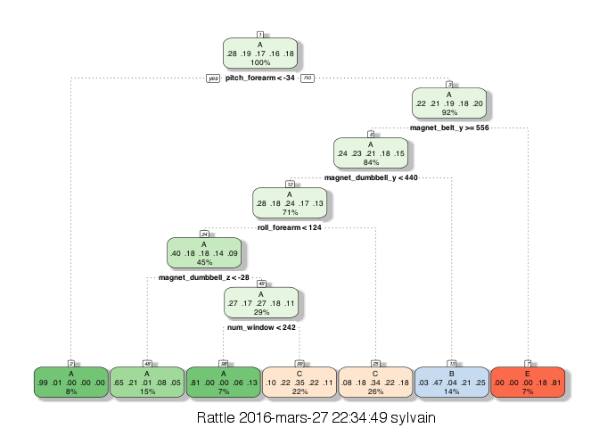
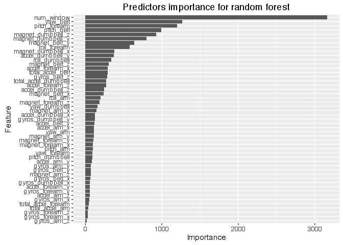
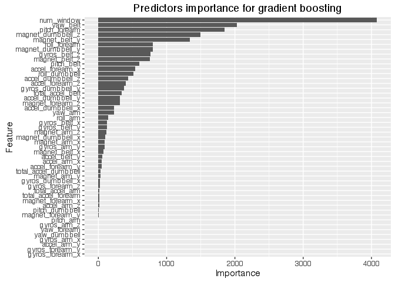
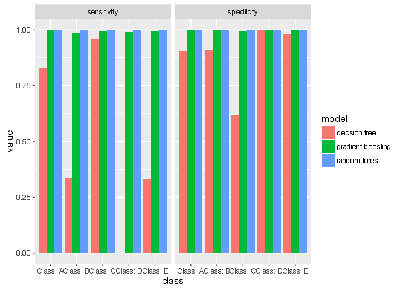

# Practical Machine Learning Assignment
Sylvain Tenier  
march 27 2016  
# Executive summary

We are tasked to create a model able to predict with great accuracy how well people do a particular activity. We are given a training set of 19622 observations from data on accelerometers on the belt, forearm, arm, and dumbell of 6 participants. We first try to fit an interpretable decision tree model that give poor results on the training set. We then create a gradient boosting model and a random forest model that provide near-perfect accuracy on the training set and 20/20 on the testing set. 


# Loading and preprocessing

We first load the datasets and remove the 6 first colums that are not related to prediction

```r
training <- read.csv("https://d396qusza40orc.cloudfront.net/predmachlearn/pml-training.csv",na.strings=c("NA","","#DIV/0!"))
training <- training[,-c(1:6)]
testing <- read.csv("https://d396qusza40orc.cloudfront.net/predmachlearn/pml-testing.csv")
```

We then remove all colmumns that have more than 95% missing values on the training set

```r
withoutNA<- training[,!colSums(is.na(training))/nrow(training)>0.95]
```

## Removing correlated variables

We then calculate highly correlated variables and remove those that are more than 95% correlated to another.

```r
suppressPackageStartupMessages(library(caret))
predictors <- withoutNA[,-which(colnames(withoutNA)=="classe")]
numPredictors<-predictors[,sapply(predictors,is.numeric)]
cm <- cor(numPredictors)
highlyCorrelated <- findCorrelation(cm, cutoff=0.95,verbose=FALSE)
drops <- colnames(numPredictors[,highlyCorrelated])
withoutCor <- withoutNA[, !(names(withoutNA) %in% drops)]
rm(withoutNA);rm(predictors);rm(numPredictors)
```

# Model trainings

## Decision tree
We start by fitting a decision tree model with 10-folds cross validation. This model allows for fast computation and good results interpretation


```r
#make the process reproducible
set.seed(1979)
modelTree <- train(classe~., data=withoutCor, method="rpart", trControl = trainControl(method = "cv"))
```

```
## Loading required package: rpart
```


## Random forest 

We then train a random forest model using cross validation. Adding PCA yields exactly the same results so is not shown in this report.


```r
modelRF <- train(classe~., data=withoutCor, method="rf", trControl = trainControl(method = "cv"))
```

## Gradient boosting

Finally we train a gradient boosting model with cross validation

```r
modelGbm <- train(classe~., data=withoutCor, method="gbm", trControl = trainControl(method = "cv"),verbose=FALSE)
```

# Results

## Predictors numbers and importance

The following figure tree shows that a small number of predictors are used by the decision tree model

```r
suppressPackageStartupMessages(library(rattle))
fancyRpartPlot(modelTree$finalModel)
```




On the other hand, both the boosted and random forest models make use of more predictors. We display them by importance on the following figure:


```r
suppressPackageStartupMessages(library(ggplot2))
rfImp <- varImp(modelRF, scale=FALSE)
gbmImp <- varImp(modelGbm, scale=FALSE)

# display variable importance estimation
ggplot(rfImp) + ggtitle("Predictors importance for random forest")
```



```r
ggplot(gbmImp) + ggtitle("Predictors importance for gradient boosting")
```



## Final validation on the training set

The following figure displays the specificity and sensitivity results on the training set for the 3 models

```r
resDT <-confusionMatrix(predict(modelTree,training),training$classe)
results=data.frame(class=row.names(resDT$byClass),sensitivity=resDT$byClass[,1],specificity=resDT$byClass[,2],model="decision tree")
resGBM <-confusionMatrix(predict(modelGbm,training),training$classe)
results=rbind(results,data.frame(class=row.names(resGBM$byClass),sensitivity=resGBM$byClass[,1],specificity=resGBM$byClass[,2],model="gradient boosting"))
resRF <-confusionMatrix(predict(modelRF,training),training$classe)
results=rbind(results, data.frame(class=row.names(resRF$byClass),sensitivity=resRF$byClass[,1],specificity=resRF$byClass[,2],model="random forest"))
suppressPackageStartupMessages(library(tidyr))
res_long=gather(results,measure, value, sensitivity:specificity)
ggplot(res_long,aes(x=class,y=value, fill=model))+geom_bar(stat="identity",position="dodge")+ facet_grid(. ~ measure)
```



We can see that both specificity and sensitivity are poor for the decision tree, very good for gradient boosting and perfect for the random forest on the training set. 

The results are consistent with the figures given for Kappa and Accuracy for each model:

```r
suppressPackageStartupMessages(library(knitr))
res=data.frame(a="Accuracy",b=max(modelTree$results$Accuracy),c=max(modelGbm$results$Accuracy),d=max(modelRF$results$Accuracy))
res=rbind(res,data.frame(a="Kappa",b=max(modelTree$results$Kappa),c=max(modelGbm$results$Kappa),d=max(modelRF$results$Kappa)))
kable(res, caption="Accuracy and Kappa for each model on the training set",col.names=c("","Decision tree","Gradient boosting","Random forest"))
```


Table: Accuracy and Kappa for each model on the training set

            Decision tree   Gradient boosting   Random forest
---------  --------------  ------------------  --------------
Accuracy        0.5473002           0.9885336       0.9988280
Kappa           0.4267578           0.9854962       0.9985176

## Predictions on the test set
Finally, we show the results on the test set for each model. Predictions for decision tree and gradient boosting are compared to predictions for random forest which yielded 100% on the grading quizz.


```r
dt=predict(modelTree,testing)
gbm=predict(modelGbm,testing)
rf=predict(modelRF,testing)
percDt=paste0(sum(dt==rf)/20*100,"%")
percGbm=paste0(sum(gbm==rf)/20*100,"%")
res <- data.frame(a="Percentage",b=percDt,c=percGbm,d="100%")
res <- rbind(res,data.frame(a=paste("Test ",c(1:20)),b=dt,c=gbm,d=rf))
kable(res, caption="Results for each model on the test set",col.names=c("","Decision tree","Gradient boosting","Random forest"))
```


Table: Results for each model on the test set

             Decision tree   Gradient boosting   Random forest 
-----------  --------------  ------------------  --------------
Percentage   40%             100%                100%          
Test  1      C               B                   B             
Test  2      A               A                   A             
Test  3      C               B                   B             
Test  4      A               A                   A             
Test  5      A               A                   A             
Test  6      C               E                   E             
Test  7      C               D                   D             
Test  8      C               B                   B             
Test  9      A               A                   A             
Test  10     A               A                   A             
Test  11     C               B                   B             
Test  12     C               C                   C             
Test  13     C               B                   B             
Test  14     A               A                   A             
Test  15     C               E                   E             
Test  16     C               E                   E             
Test  17     A               A                   A             
Test  18     A               B                   B             
Test  19     A               B                   B             
Test  20     C               B                   B             

# Discussion

The aim of this report was to demonstrate how we could predict the manner in which the participants did the exercise. We now answer the requested questions:

## How was the model built

The training data was cleaned to remove data not related to the prediction, with more than 95% of missing values and with high corelation. From those, 3 different models were built:. 

* The *decision tree* model makes use of a limited set of predictors and is the fastest to train.
* The *gradient boosting* model uses more predictors and uses more computation
* The *random forest* model uses the highest number of predictors and is the most computationally expensive.

## How was cross validation used

For each model, cross validation was used with 10 folds.

## Estimation of the expected out of sample errors
 
Since cross-validation was used, the expected out of sample error is not explicit in the results. However, accuracy and kappa numbers should be representative. We see in the results that this checks out, since:

* the decision tree model had an accuracy of 42% and predicted 40% of the test set,
* gradient boosting had between 98% and 99% and predicted all 20 observations of the test set,
* random forest was over 99% and predicted all 20 observations.

## Justification of choices

I made the decision of using tree-based models since they allow for classification with non-binary outputs. I chose to fit 3 different models to evaluate the influence of the predictors/complexity tradeoffs. I used cross-validation to maximise the chance of predicting all 20 observations of the test set.

## Prediction of 20 different test cases.

The graded quizz proced that the 20 different test cases were predicted correctly by both gradient boosting and random forest model. 

# Conclusion

This assignment was a superb opportunity to practice and digest all the information given in the course. The results confirm the elements given in the videos and the documentation.
